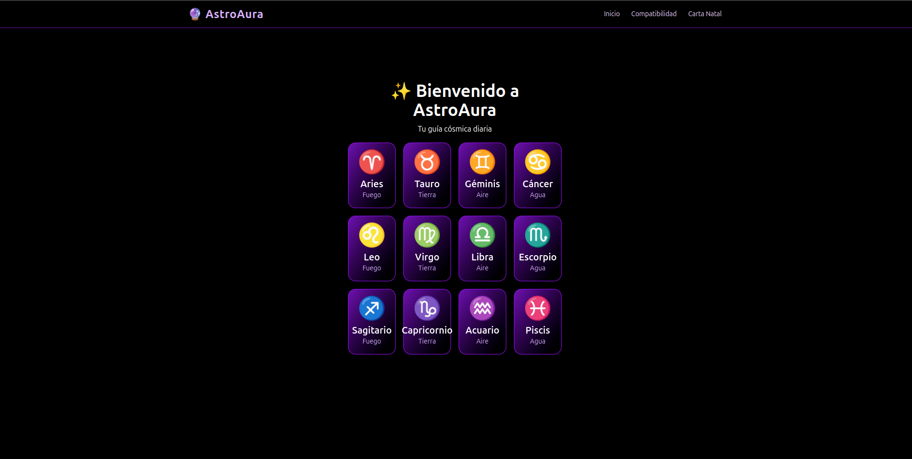
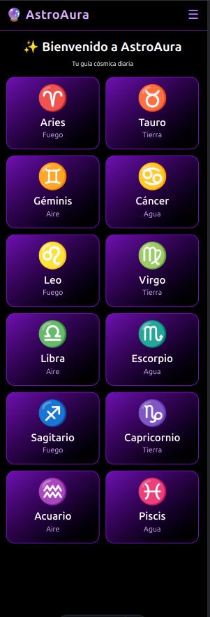

# AstroAura 🌌

AstroAura es una aplicación web progresiva (PWA) que te permite explorar el mundo de la astrología. Descubre tu horóscopo diario, compatibilidad entre signos y tu carta astral, todo en un diseño moderno y accesible.

## 🚀 Características

- **Horóscopo diario**: Obtén predicciones personalizadas para tu signo zodiacal.
- **Compatibilidad entre signos**: Descubre qué tan compatible eres con tu pareja o crush.
- **Carta astral**: Explora los aspectos más profundos de tu personalidad según la astrología.
- **PWA**: Instala la aplicación en tu dispositivo y úsala sin conexión.
- **Diseño responsivo**: Optimizado para dispositivos móviles, tabletas y escritorio.

## 🖼️ Capturas de pantalla




## 🛠️ Tecnologías utilizadas

- [Astro](https://astro.build/) - Framework para construir sitios web rápidos.
- [Tailwind CSS](https://tailwindcss.com/) - Framework de estilos para un diseño moderno y responsivo.
- [Service Workers](https://developer.mozilla.org/es/docs/Web/API/Service_Worker_API) - Para funcionalidad offline.
- [JSON](https://www.json.org/json-en.html) - Para almacenar datos de compatibilidad entre signos.

## 📦 Instalación

Sigue estos pasos para ejecutar el proyecto en tu entorno local:

1. Clona el repositorio:
   ```bash
   git clone https://github.com/tu-usuario/astro-aura-pwa.git
   cd astro-aura-pwa
